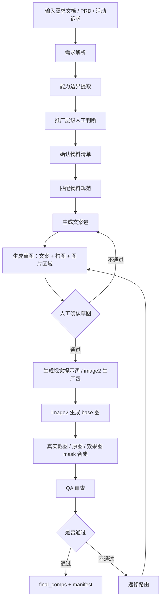

# 推广物料生成工作流设计文档

生成时间：2026-05-07
来源对话：`codex://threads/019dd885-b153-7ef0-b2ca-b5a02c1659eb`
当前项目：`/Users/admin/Desktop/运营推广材料/服务市场详情页`
状态：DRAFT v2
模式：内部生产工作流设计

## 1. 问题定义

现在的真实需求不是“自动生成一张 banner”。

真实需求是：运营拿到一个产品需求、功能上新说明、PRD 或活动诉求后，需要先判断这件事值得做到哪一层推广，再按对应物料规范生成可用成品。

也就是说，工作流入口应该是：

`需求文档 / PRD / 功能说明 / 活动诉求`

工作流出口应该是：

`推广层级判断 + 物料清单 + 文案包 + 设计生成提示词 + mask/截图要求 + 成品图 + QA 记录 + 返修意见`

旧线程已经验证过一个很重要的约束模型：

- 画布是强约束，例如稿定功能推广 banner 必须 `1200 x 120`，稿定功能推广弹窗必须 `700 x 550`。
- 字体是强约束，必须使用规范指定字体，并在生成前校验字体可加载。
- 文案区域是弱约束，可以适配、缩字号、换行，但必须把调整写入审计结果。

这条规则要保留，并扩展到服务市场详情页、首页头图、banner、弹窗等所有物料。

## 2. 旧线程提炼

旧线程里完成过一个 banner / popup 自动生成雏形，目录在：

`/Users/admin/tongbu/视频剪辑工具/视频剪辑之带货视频`

已验证产物：

- `config/visual_spec.json`：规范配置
- `examples/brief.json`：需求输入示例
- `scripts/generate_visuals.py`：生成脚本
- `output/<campaign>_manifest.json`：审计结果

旧线程最有价值的结论：

1. 不要把规范写死在提示词里，规范要配置化。
2. 画布尺寸和字体必须硬校验。
3. 文案区域不是硬失败条件，而是布局提示。放不下时可以自动缩字号，但必须记录 `fit / adjusted / soft_region_overflow`。
4. 每次生成都要有 manifest，不然无法追踪成品是否真的符合规范。

旧线程的不足：

1. 只覆盖 banner 和弹窗，没有覆盖首页、详情页、功能上新图、功能配图。
2. 没有推广层级判断，默认每个需求都生成 banner + popup。
3. 没有区分“纯文案促销物料”和“需要截图/mask/真实素材证明的产品功能物料”。
4. 视觉生成还是本地脚本画图，适合工程验证，不适合任何对外成品级物料。

本轮修正：

1. banner / 弹窗也必须由 image2 做完整视觉和中文排版。
2. 本地脚本不再负责画成品视觉，只负责 mask 合成、尺寸校验、字体/文案审计、manifest。
3. 如果有原始截图，image2 只预留截图区域，本地把真实截图 mask 上去。
4. 如果需要用户上传原图和效果图，image2 预留素材区域，本地按 mask 合成。
5. 小画布物料不能照搬详情页素材结构。详情页可以展示 5 张原图 + 5 张效果图，弹窗篇幅有限时必须重新策展素材数量和展示结构。
6. 为提高 image2 使用效率，必须先产出草图让人工确认。草图确认通过后，才进入 image2 视觉设计和 mask 区域覆盖。

## 3. 新工作流目标

这套工作流要解决 5 个问题：

1. 需求输入标准化：把 PRD、功能说明、活动诉求转成统一 brief。
2. 推广层级人工判断：判断这个需求应该做到弹窗、banner、首页头图、服务市场详情页，还是完整推广包。
3. 物料规范路由：确认物料后，调用对应规范，不混用尺寸、文案层级、色板和截图规则。
4. 成品生产可追踪：每个输出都有 manifest、QA、返修路由，避免靠聊天记录记忆。
5. 跨物料二次策展：同一个需求进入不同尺寸时，必须重新判断素材数量、信息密度和展示结构。
6. image2 成本控制：先确认文案、构图和图片区域，减少 image2 用来试错构图。

## 4. 推广层级模型

推广不是按“能做什么图”决定，而是按需求价值、用户影响范围、证明材料强度和投放位置决定。

### L0：不生成图，只输出文案建议

适合：

- 需求还不确定
- PRD 没有最终能力边界
- 只有内部讨论，没有上线时间
- 缺少截图、素材、功能入口

输出：

- 需求摘要
- 用户价值一句话
- 物料风险提示
- 缺失信息清单

### L1：轻量提醒物料

适合：

- 小活动
- 功能入口提醒
- 限时通知
- 老用户召回
- 不需要大篇幅解释

物料：

- 弹窗 `700 x 550`
- 或 banner `1200 x 120`

判断标准：

- 用户看 3 秒能懂
- 不需要截图证明
- 只有 1 个 CTA
- 文案能压缩成主标题、副标题、按钮文案

### L2：站内曝光物料

适合：

- 功能上新
- 运营活动
- 入口引导
- 用户需要知道“在哪里用”

物料：

- banner
- 弹窗
- 首页局部模块
- 功能入口小图

判断标准：

- 需要解释功能位置
- 需要 2-3 个利益点
- 可能需要按钮或路径
- 但不需要完整功能证明链

### L3：首页 / 服务市场头图

适合：

- 重点功能上新
- 需要第一屏强化认知
- 能力比单点活动更大
- 需要展示功能价值和关键场景

物料：

- 服务市场详情页 `part1` 头图 / 功能上新图
- 首页头图
- 功能汇总头图

判断标准：

- 有明确功能名
- 有明确用户痛点
- 有可证明的功能位置或示例素材
- 需要用视觉结构解释“这次新增了什么”

### L4：完整详情页推广包

适合：

- 新产品
- 新模块
- 核心付费能力
- 需要销售转化或服务市场上架
- 用户需要完整理解能力范围

物料：

- `part1` 头图 / 功能上新图
- `part2` 功能汇总图
- 多张 `part3` 功能配图 / 功能说明图
- banner
- 弹窗
- 首页入口图
- 素材总览
- QA 和返修单

判断标准：

- 不止一个功能点
- 需要多个场景解释
- 需要真实后台截图、素材图、对比图或 mask 合成
- 产物会进入长期对外页面

## 5. 推广层级判断表

人工判断时先填这张表。

| 判断项 | L1 | L2 | L3 | L4 |
| --- | --- | --- | --- | --- |
| 需求类型 | 活动 / 提醒 | 上新 / 引导 | 重点功能上新 | 新产品 / 核心模块 |
| 用户理解成本 | 很低 | 中低 | 中 | 高 |
| 是否需要截图证明 | 否 | 可选 | 建议有 | 必须有 |
| 是否需要功能位置 | 可选 | 必须 | 必须 | 必须 |
| 是否需要多场景 | 否 | 否 | 可选 | 必须 |
| 投放周期 | 短 | 短中 | 中 | 长 |
| 输出物料数 | 1-2 张 | 2-4 张 | 1-3 张 | 5 张以上 |

判定规则：

- 只要涉及长期上架、服务市场详情页、销售转化，最低按 L3。
- 只要需求需要 3 个以上能力点解释，按 L4。
- 只要没有截图、素材、入口、PRD 边界，最多按 L1/L2，不能直接进 L3/L4 成品。
- 只要出现未验证能力、未证明数据、夸张效果承诺，必须退回补证据。

## 6. 总流程



草图确认门是强制步骤。草图不追求视觉完成度，只确认 4 件事：

1. 文案是否正确。
2. 构图是否适合当前物料尺寸。
3. 图片区域、截图区域、原图/效果图区域是否合理。
4. 素材数量是否适合当前物料，尤其是 banner / 弹窗这种小画布。

## 7. 输入 brief 结构

建议把所有需求先整理成统一 `brief.json` 或 `brief.md`。

```json
{
  "request_id": "ai-product-image-optimization-20260507",
  "source_type": "prd | feature_doc | campaign | manual",
  "product_name": "AI 商品图优化",
  "business_goal": "提升商家商品主图优化效率",
  "target_user": "抖店服务市场商家 / 多店铺运营",
  "user_pain": [
    "主图制作成本高",
    "不同商品卖点提炼不稳定",
    "需要基于商品信息快速重规划主图"
  ],
  "feature_scope": [
    "选择商品任意位置主图",
    "基于原图/详情图/属性/标题提炼卖点",
    "重新规划生成新的主图"
  ],
  "feature_location": "多店铺管理 - AI 商品图",
  "proof_assets": {
    "screenshots": [],
    "source_images": [],
    "generated_images": [],
    "reference_layouts": []
  },
  "must_not_claim": [
    "未证明的转化率提升",
    "未确认的耗时数据",
    "PRD 外发布/回填能力"
  ],
  "desired_channels": [
    "service_market_detail",
    "banner",
    "popup"
  ],
  "deadline": "",
  "review_owner": ""
}
```

## 8. 人工判断节点

自动化可以建议层级，但最终必须人工确认。

人工判断输出：

```json
{
  "promotion_level": "L3",
  "reason": "重点功能上新，需要在服务市场首屏解释能力和功能位置",
  "materials": [
    "service_market_part1_header",
    "banner_1200x120",
    "popup_700x550"
  ],
  "blocked_materials": [
    {
      "material": "full_detail_page",
      "reason": "当前只有一个核心能力点，暂不需要 L4 完整详情页"
    }
  ],
  "evidence_required": [
    "功能位置截图或路径",
    "原图/生成图素材",
    "不支持能力清单"
  ]
}
```

## 9. 物料规范路由

### Banner

规格：

- 画布：`1200 x 120`，强约束
- 规范来源：`/Users/admin/Desktop/运营推广材料/banner规范/稿定-功能推广banner规范.html`
- 参考示例图：`/Users/admin/Desktop/运营推广材料/banner规范/稿定-功能推广banner规范_files/20230510-151223-_KdwU(1).jpg`
- 字体：强约束
- 文案区域：弱约束
- 主视觉：image2 完整生成
- 本地合成：只贴入真实截图 / 原图 / 效果图，不重画视觉

内容结构：

- 主标题
- 副标题
- 可选 badge
- CTA 按钮
- 可选 1 个小型素材槽

规范版式：

- 左侧为功能插画或策展后的素材缩略区。
- 中间为主标题 + 一行说明文案。
- 右侧为单一主按钮。
- 不在 banner 内承载超过一个视觉证明结构。

适合：

- 活动
- 功能入口提醒
- 简短利益点

素材规则：

- banner 高度只有 `120`，不适合展示复杂对比链路。
- 如果详情页素材是 5 张原图 + 5 张效果图，banner 只能选 1 个最能代表价值的局部、1 组前后对比，或只展示生成后的结果图。
- 不允许把多张商品图压成看不清的小图阵列。

产物：

- `<request_id>_banner_base.png`
- `<request_id>_banner.png`
- `<request_id>_banner_mask.json`
- `<request_id>_banner_manifest.json`

### 弹窗

规格：

- 画布：`700 x 550`，强约束
- 规范来源：`/Users/admin/Desktop/运营推广材料/弹窗规范/稿定-弹窗规范.html`
- 参考示例图：`/Users/admin/Desktop/运营推广材料/弹窗规范/稿定-弹窗规范/20230510-151224-ThleY(1).jpg`
- 字体：强约束
- 按钮区域：强视觉结构，文字区域弱约束
- 主视觉：image2 完整生成
- 本地合成：只贴入真实截图 / 原图 / 效果图，不重画视觉

内容结构：

- 主标题
- 副标题
- 1-3 条短功能点或补充说明
- CTA 按钮
- 可选 1-3 个素材槽

规范版式：

- 上半区为浅蓝背景和主视觉，标题区与功能插画 / 素材缩略区并列。
- 中下区为白色内容卡。
- CTA 是底部单一主按钮。
- 弹窗只讲一个主卖点，最多承载一个主证明结构。

适合：

- 上线提醒
- 活动触达
- 用户行动召回

素材规则：

- 弹窗不是小号详情页。它只能承载一个主卖点，一个行动按钮，一组最强证明素材。
- 如果详情页是 5 张原图生成 5 张效果图，弹窗需要二次调整：
  - 方案 1：只展示 1 组代表性原图/效果图前后对比。
  - 方案 2：展示 3 张效果图，表达“多风格主图生成”。
  - 方案 3：只展示最终效果图合集，不展示原图。
  - 方案 4：基于素材库重新选择更适合弹窗比例的 1-2 张图。
- 任何弹窗素材选择都必须优先保证用户 2 秒内看懂。

产物：

- `<request_id>_popup_base.png`
- `<request_id>_popup.png`
- `<request_id>_popup_mask.json`
- `<request_id>_popup_manifest.json`

### 服务市场详情页 part1

规格：

- 画布：`816 x 1054`，强约束
- 内置 image2：`2k`、`high`
- 本地合成：只负责截图 / 素材贴入，不负责大段中文排版

内容结构：

- 顶部标签
- 大标题
- 一句话价值
- 1-2 个功能板块
- 示例素材或功能路径

适合：

- 功能上新
- 重点能力解释
- 服务市场首屏

产物：

- `<request_id>_part1_base.png`
- `<request_id>_part1_final.png`
- `<request_id>_part1_mask.json`
- `<request_id>_qa.md`

### 服务市场详情页 part2

规格：

- 画布：`816 x 1054`
- 适合功能汇总，不适合放过细流程

内容结构：

- 总标题
- 3-6 个能力卡片
- 功能范围说明

适合：

- 多功能模块
- L4 完整详情页

### 服务市场详情页 part3

规格：

- 画布：`816 x 982`
- 必须分型：功能配图 / 功能说明 2 图混合层

内容结构：

- 功能标题
- 2-3 条证明点
- 真实截图、局部放大、对比图或素材图

适合：

- 单功能证明
- 后台截图说明
- AI 生成效果对比

## 10. 生产包目录结构

建议每个需求独立一个 case。

```text
cases/<request_id>/
  00_source/
    prd.md
    raw_requirement.md
    screenshots/
    assets/
    reference/
  01_brief/
    brief.json
    promotion_level_decision.json
  02_copy/
    copy_pack.md
    claims_guardrail.md
  03_specs/
    material_spec_resolved.json
    mask_plan.md
  04_wireframe/
    wireframe.md
    wireframe.png
    wireframe_approval.md
  05_prompts/
    image2_prompts.md
    local_composite_plan.md
  06_base/
    image2_base/
  07_final/
    final_comps/
    manifest.json
    qa.md
    revision_routing.md
```

`04_wireframe/` 是 image2 前置门。

草图必须包含：

- 当前物料尺寸
- 标题、副标题、按钮文案
- 主要视觉区域
- 截图 / 原图 / 效果图 mask 区域
- 素材数量和取舍理由
- 是否允许进入 image2

没有 `wireframe_approval.md`，不能进入 `05_prompts/`。

## 11. 文案生成规则

文案先按需求层级生成，不按物料形状硬套。

先产出统一文案包：

- 用户痛点
- 功能名
- 一句话价值
- 3 条以内功能证明
- 功能位置
- CTA
- 禁用表达

再按物料裁剪：

- banner：裁成 1 个主标题 + 1 个副标题 + 1 个按钮
- 弹窗：裁成标题、副标题、补充说明、按钮
- part1：保留功能名、价值句、示例场景、关键证明图
- part2：保留模块清单
- part3：一张图只讲一个功能证明点

禁止：

- 不写 PRD 外能力
- 不写未证明数字
- 不写“100%”“一键爆单”“转化翻倍”等不可证承诺
- 不写用户看不懂的内部模块名，除非它就是功能入口

## 12. 视觉生成规则

### image2 负责什么

适合：

- banner
- 弹窗
- 首页头图
- 服务市场详情页 part1 / part2 / part3 base 图
- 复杂视觉层级
- 中文标题和正文排版
- 卡片、背景、图标、容器、阴影
- 截图 / 素材容器

强制要求：

- 分辨率：`2k`
- 质量：`high`
- 输出时预留截图 / 素材 mask 区域
- 不生成假后台、假表格、假数据
- 不把用户提供的商品原图、效果图、后台截图重绘成假图
- 不把详情页的大素材结构原样塞进小画布物料

### 本地合成负责什么

只做：

- 真实截图贴入
- 商品原图贴入
- 商品效果图贴入
- 1:1 或指定比例图槽 mask
- 圆角、描边、阴影
- 必要脱敏
- 输出尺寸校验
- manifest 审计

不做：

- 重画中文排版
- 重排标题层级
- 用代码硬补大段文案
- 用脚本直接画 banner / 弹窗成品视觉

### 本地脚本适合做什么

适合：

- 读 mask 坐标
- 裁切真实截图
- 裁切原图/效果图
- 合成到 image2 base 图
- 校验画布尺寸
- 校验图片是否清晰、是否拉伸
- 写出 manifest 和 QA 草稿

不做：

- 视觉创作
- 卡片设计
- 中文排版
- 活动氛围设计

## 12.5 跨尺寸素材策展规则

同一个需求进入不同物料时，素材不能一比一搬运。

详情页任务可以承载完整证明链，例如：

- 5 张原图
- 5 张效果图
- 原图/效果图对比
- 功能入口和流程说明

但 banner / 弹窗要重新策展：

- banner：最多 1 个视觉证据点，优先展示最终效果或单组对比。
- 弹窗：最多 1 个主证明结构，通常是 1 组前后对比、3 张效果图，或 1 张效果合集。
- 首页头图：可以展示 2-3 个素材，但必须为首屏服务，不做完整流程说明。
- 服务市场 part1：可以展示核心场景，但不展开所有细节。
- 服务市场 part3：才适合承载完整的 5 组对比或多图说明。

素材策展输出必须写入 `material_curation.json`：

```json
{
  "source_materials": {
    "original_images": 5,
    "generated_images": 5,
    "screenshots": 0
  },
  "material": "popup_700x550",
  "selected_strategy": "single_before_after_pair",
  "selected_assets": [
    {
      "slot": "before",
      "source": "original_images[1]",
      "reason": "主体清晰，能快速看懂优化前状态"
    },
    {
      "slot": "after",
      "source": "generated_images[1]",
      "reason": "效果差异最大，适合弹窗首屏证明"
    }
  ],
  "dropped_assets": [
    {
      "source": "original_images[2-5] + generated_images[2-5]",
      "reason": "弹窗篇幅有限，保留会降低识别效率"
    }
  ]
}
```

## 13. QA 清单

每个需求最终必须检查：

1. 推广层级是否合理。
2. 物料清单是否和层级一致。
3. 每张图是否使用了正确规范。
4. 画布尺寸是否强校验通过。
5. 字体是否强校验通过。
6. 文案区域弱适配是否有 `adjusted` 或 `soft_region_overflow`。
7. 所有对外成品图是否由 image2 完成完整视觉和中文排版。
8. 截图 / 原图 / 效果图 mask 是否自然。
9. 小画布物料是否做过素材二次策展。
10. 是否出现 PRD 外能力。
11. 是否出现未证明数据。
12. 是否有 manifest、QA、返修记录。

Blocking 问题：

- L1/L2 的活动物料误做成详情页口径。
- L3/L4 的服务市场物料缺少功能位置或证明素材。
- 使用本地脚本硬画任何对外成品物料。
- banner / 弹窗把详情页的多图证明链路硬塞进去。
- 文案遮挡、溢出、图字互挡。
- AI 生成假后台截图。
- 出现未经确认的效果数据。

## 14. 方案对比

### 方案 A：轻量脚本扩展

概要：

沿用旧线程的 banner/popup 工具，只把更多物料尺寸加进去。

优点：

- 上手最快
- 适合简单物料
- manifest 机制已有雏形

缺点：

- 容易把所有物料都工程化
- 对外成品质量不够
- 没有真正解决“先判断层级”的问题
- 不符合本轮确认的 image2 生产纪律

适合：

- 只适合内部验证和 manifest 校验
- 不适合最终发布物料

### 方案 B：分层路由工作流

概要：

先把需求转 brief，再人工确认推广层级和物料清单。所有成品视觉都走 image2 + mask + QA，本地脚本只做合成、校验和审计。

优点：

- 符合真实生产决策
- 不会把 banner、弹窗、详情页混成一类
- 既能复用旧线程的强约束经验，也能保证所有物料的成品视觉质量
- 能处理小画布素材二次策展

缺点：

- 需要维护更多规范
- 每个 case 要有 manifest 和 QA，流程更重
- image2 prompt 和 mask 规划必须更严谨

适合：

- 当前项目主线
- 服务市场详情页 + banner + popup 的统一生产

### 方案 C：全自动投放包生成

概要：

需求输入后自动判断层级、自动生成所有物料、自动 QA，只在最后给人审。

优点：

- 长期效率最高
- 批量生产能力强

缺点：

- 风险高
- 推广层级判断容易误判
- 没有足够历史数据前，自动决策不可信

适合：

- 后续积累 30-50 个已审核 case 后再做

## 15. 推荐方案

推荐选择 **方案 B：分层路由工作流**。

原因很简单：你的真实瓶颈不是“能不能生成图”，而是“一个需求到底该生成什么级别的推广物料”。这个判断必须先发生。

推荐 V1 流程：

1. 输入 PRD / 需求。
2. Codex 输出 `brief.json`。
3. 人工确认推广层级：L0-L4。
4. Codex 输出物料清单。
5. Codex 输出草图：文案、构图、图片区域、素材数量。
6. 人工确认草图。
7. 按物料调用规范：
   - L1/L2：image2 生成 banner / popup base 图，本地 mask 合成真实素材。
   - L3/L4：image2 生成服务市场 base 图，本地 mask 合成真实素材。
8. 生成 manifest。
9. QA。
10. 返修或输出 final。

## 16. 下一步落地任务

优先做 7 个文件，而不是先写大工具：

1. `config/material_taxonomy.json`

定义 L0-L4、判断条件、可输出物料。

2. `config/material_specs/`

按物料拆规范：

- `banner_1200x120.json`
- `popup_gaoding_function_promo.json`
- `service_market_part1_816x1054.json`
- `service_market_part2_816x1054.json`
- `service_market_part3_816x982.json`

3. `templates/brief_template.json`

统一 PRD 输入字段。

4. `templates/promotion_level_decision.md`

人工判断表单。

5. `templates/qa_checklist.md`

统一发布前检查表。

6. `templates/material_curation.md`

定义不同尺寸下如何从素材库重新选择素材、减少图量、改变展示结构。

7. `templates/wireframe_approval.md`

定义 image2 前的草图确认表，必须包含文案、构图、图片区域和素材取舍。

然后再扩展脚本：

```bash
detail-material-workflow init --request <request_id>
detail-material-workflow classify --brief cases/<request_id>/01_brief/brief.json
detail-material-workflow package --materials cases/<request_id>/01_brief/promotion_level_decision.json
detail-material-workflow qa --case cases/<request_id>
```

## 17. 成功标准

V1 成功标准：

- 输入一个需求后，能稳定输出 L0-L4 层级建议。
- 人工能在 3 分钟内确认物料清单。
- image2 前必须先确认草图，不用 image2 反复试错构图。
- banner / popup 也由 image2 输出完整视觉。
- 所有物料都不会再用本地脚本硬压中文或硬画卡片。
- 小画布物料能从详情页素材中重新选择合适数量和结构。
- 每个 case 都有 manifest、QA 和返修记录。

V2 成功标准：

- 能基于历史 case 自动推荐推广层级。
- 能自动发现缺素材、缺截图、缺功能位置。
- 能把同一个需求裁剪成不同物料口径。
- 能把所有输出归档成可复用案例库。

## 18. 我注意到的关键判断

- 你不是在要“一个更会画图的提示词”。你要的是一个生产决策系统，先判断做多大，再决定做什么图。
- 旧线程里“画布/字体强约束，文案区域弱约束”这个判断是对的，应该成为所有轻量物料的底层规则。
- 服务市场详情页和 banner/popup 不能用同一套素材密度。它们都要用 image2 做完整视觉，但小画布必须重新策展素材。
- 弹窗不是缩小版详情页。5 张原图 + 5 张效果图这种证明链路，需要在弹窗里压缩成 1 组对比、3 张效果图或单张合集。
- 人工判断不能被拿掉。现阶段 AI 可以建议层级，但不能替运营决定一个需求是否值得做 L4 完整详情页。
